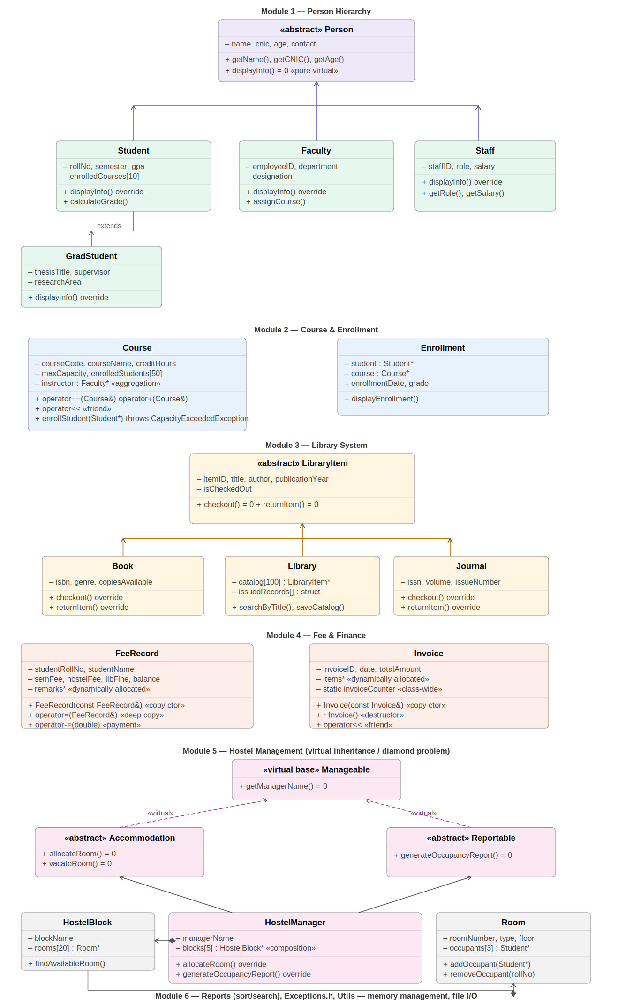

# Smart Campus Management System (SCMS)

## Project Info
- **Student:** Abdullah Butt | **Roll No:** 25-CS-078 | **Course:** CS-104L: OOP | **HITEC University Taxila**

## Project Description
The Smart Campus Management System (SCMS) is a fully object-oriented C++17 console application that models the key operations of a university campus. It manages students, faculty, staff, courses, library items, hostel rooms, and student fees through six tightly integrated modules. Every core OOP concept taught in CS-104L — from abstract classes and runtime polymorphism to copy semantics, operator overloading, and custom exceptions — is demonstrated in a real-world context. The system also persists library data to disk using `fstream` and generates a consolidated campus report at runtime.

## OOP Concepts Demonstrated

| # | Concept | Where Used |
|---|---------|------------|
| 1 | Classes & Objects | All 6 modules |
| 2 | Encapsulation (getters/setters) | Every class |
| 3 | Constructors (default, param, copy) | Person, Course, FeeRecord, Invoice |
| 4 | Destructors | Library, HostelBlock, HostelManager, Invoice, FeeRecord |
| 5 | Single Inheritance | Student : Person, Faculty : Person, Staff : Person |
| 6 | Multi-level Inheritance | GradStudent : Student : Person |
| 7 | Multiple Inheritance | HostelManager : Accommodation, Reportable |
| 8 | Virtual Inheritance | Manageable virtual base resolves diamond in Module 5 |
| 9 | Abstract Classes & Pure Virtual | Person, LibraryItem, Accommodation, Reportable, Manageable |
| 10 | Runtime Polymorphism | `displayInfo()` called via `Person*`; `checkout()` via `LibraryItem*` |
| 11 | Operator Overloading | Course (`==`, `<<`, `+`), FeeRecord (`-=`), Invoice (`<<`) |
| 12 | Friend Functions | `operator<<` for Course and Invoice |
| 13 | Static Members | `Invoice::invoiceCounter` auto-increments per invoice |
| 14 | Copy Constructor (Deep Copy) | FeeRecord copies `remarks` string array |
| 15 | Copy Assignment & Destructor | FeeRecord (Rule of Three), Invoice (dynamic items array) |
| 16 | Search Functions | `Library::searchByTitle()`, `Reports::findStudentByRollNo()` |
| 17 | Array-based Collections | Library catalog as `LibraryItem*[]`; issued records struct array |
| 18 | Arrays of Objects | Room occupants, HostelBlock rooms, global student/faculty/course arrays |
| 19 | Exception Handling | CapacityExceededException, OverdueException, InvalidPaymentException, RoomFullException |
| 20 | File I/O (fstream) | Library::saveCatalog() / loadCatalog() persist to `data/library_catalog.txt` |
| 21 | Reporting & Utilities | Reports.h / Reports.cpp — campus report, student/faculty/course listings |
| 22 | Memory Management | `new`/`delete` throughout; cleanupGlobals() in main |
| 23 | Sorting and Searching | Reports::sortStudentsByGPA(), sortStudentsByName(), findStudentByRollNo() |
| 24 | Composition | HostelBlock (owns Room objects); HostelManager (owns HostelBlock objects) |
| 25 | Aggregation | Course holds `Faculty*` reference (does not own the Faculty object) |

## Modules

| Module | Description |
|--------|-------------|
| **Module 1 – Person Hierarchy** | Abstract `Person` base with `Student`, `GradStudent` (multi-level), `Faculty`, and `Staff` subclasses. Demonstrates runtime polymorphism via `displayInfo()`. |
| **Module 2 – Course & Enrollment** | `Course` with enrollment cap, waiting list, operator overloading (`==`, `<<`, `+`), and `Enrollment` records. Throws `CapacityExceededException`. |
| **Module 3 – Library System** | `LibraryItem` abstract hierarchy (`Book`, `Journal`). `Library` manages a catalog array, supports `searchByTitle()`, issues/returns items, persists via `fstream`, and throws `OverdueException`. |
| **Module 4 – Fee & Finance** | `FeeRecord` with deep-copy constructor, copy assignment, and `operator-=` for payments. `Invoice` uses a `static invoiceCounter` and a dynamic items array with destructor. |
| **Module 5 – Hostel Management** | `Room` → `HostelBlock` (composition) → `HostelManager` (multiple + virtual inheritance from `Accommodation` and `Reportable`). Demonstrates the diamond problem solution. |
| **Module 6 – Reports & Utilities** | `Reports` class provides sorting (GPA, name), linear search, per-module display helpers, and a consolidated campus report saved to disk. |

## How to Compile & Run

```bash
g++ -std=c++17 -Wall -Wextra \
  src/person/Person.cpp src/person/Student.cpp src/person/GradStudent.cpp \
  src/person/Faculty.cpp src/person/Staff.cpp \
  src/course/Course.cpp src/course/Enrollment.cpp \
  src/library/LibraryItem.cpp src/library/Book.cpp \
  src/library/Journal.cpp src/library/Library.cpp \
  src/finance/FeeRecord.cpp src/finance/Invoice.cpp \
  src/hostel/Room.cpp src/hostel/HostelBlock.cpp src/hostel/HostelManager.cpp \
  src/utils/Reports.cpp src/main.cpp -o scms

mkdir -p data
./scms
```

## UML Class Diagram


## GitHub Repository
https://github.com/[username]/HITEC-OOP-SCMS-[RollNo]
